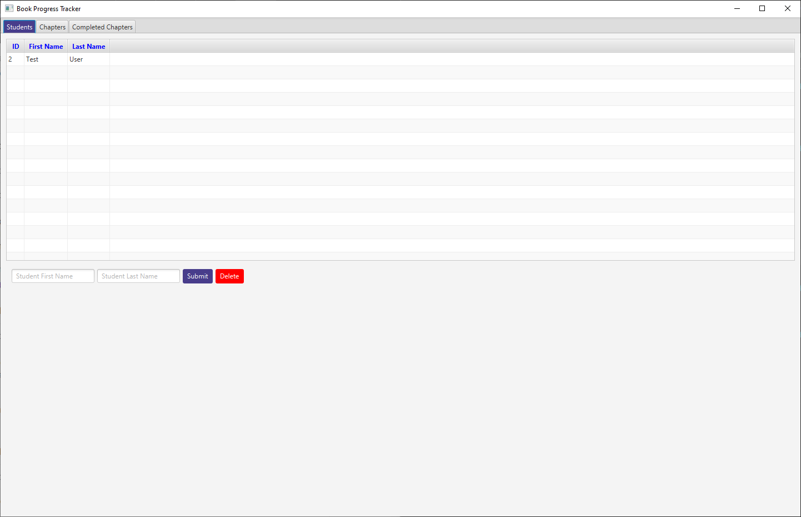
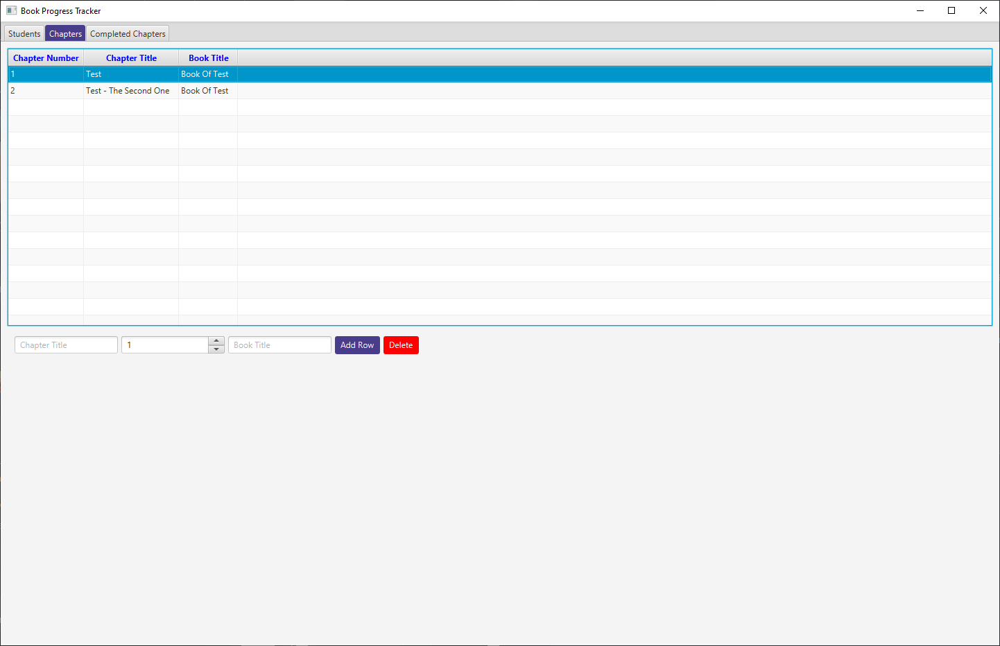
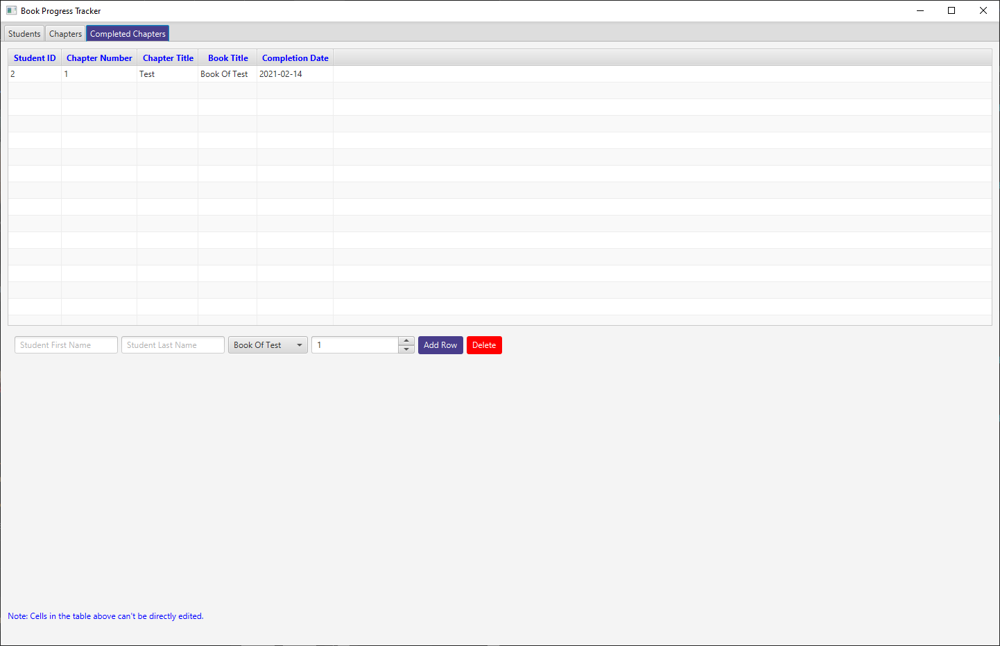

# Book-Progress-Tracker
This is a progress tracker I'm making to track my progress throughout different books.
   

## Table of Contents
* [Pictures!](#pictures)
* [Tech Used](#tech-used)
* [Table Structure](#table-structure)
  * [Student Table](#student-table)
  * [Chapter Table](#chapter-table)
  * [Student_Progress](#student_progress)

## Pictures!
Here's the student tab!

Here's the chapter tab!

And here's the completed chapter tab!

## Tech Used
- Core Java 15
- GUI Framework: JavaFX 15

## Table Structure
The top levels have the column names and associated types

### Student Table
This table keeps track of students, including their IDs and Names
| STUDENT_ID(Long) | FIRST_NAME(String) | LAST_NAME(String) |
| :---: | :---: | :---: |
| 1 | ExampleFirst | ExampleLast |

### Chapter Table
This table keeps track of how many chapters there are, and their associated titles. 
| CHAPTER_TITLE(String) | CHAPTER_KEY(Long) | CHAPTER_NUMBER | BOOK |
| :---: | :---: | :---: | :---: |
Chapter 1: Example | 1 | 1 | The Example Book |

### Student_Progress
This table tracks students' progress, containing the ID of the student who completed the chapter, the ID of the chapter that's been completed, and the date that the chapter has been completed on. 
| STUDENT_ID(Long) | CHAPTER_NUMBER(Long) | COMPLETION_DATE(Date) | BOOK | CHAPTER_TITLE |
| :---: | :---: | :---: | :---: | :---: |
| 1 | 1 | 2021-1-3 | The Example Book | Chapter 1: Example
